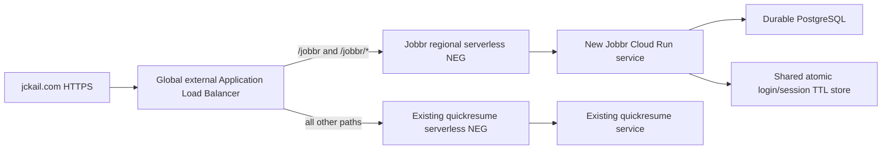

# Cloud Run deployment alternative

This is a reviewed architecture and read-only inventory procedure, not an applied
deployment. Kubernetes remains the original planned production platform. Cloud
Run with a global external Application Load Balancer is an alternative requiring
a selected project, cost approval, durable database, and auth-state work before
provisioning. No cloud resources or DNS records were changed for this review.

## Existing domain routing

Read-only inspection on 2026-10-01 established:

- Active CLI account is `jckail13@gmail.com`; no default project is configured.
- In `portfolio-383615`, region `us-central1`, Cloud Run domain mappings for
  `jckail.com` and `www.jckail.com` point to **`quickresume`**, with Ready,
  CertificateProvisioned and DomainRoutable true. `portfloliowebsite` exists but
  is not the domain mapping's backend.
- `quickresume` reports URL `https://quickresume-vbufkr2qma-uc.a.run.app` and ready
  revision `quickresume-00354-lob` at inspection time.
- The project's Compute URL-map/forwarding-rule and Cloud DNS managed-zone
  inventories were empty. This does not establish ownership of DNS elsewhere.
- Public apex DNS resolves to Google domain-mapping IPv4/IPv6 addresses;
  `https://jckail.com/` returns 200, while `/jobbr` and `/jobbr/` return 404.

These are observations of existing infrastructure, not authorization to use that
project for Jobbr. Never change the unrelated EKS kubectl context for this plan.

Repeat the sanitized inventory without installing CLI components:

```sh
python3 deploy/cloud-run/preflight.py --project portfolio-383615 --region us-central1
```

The script only reads credentials/account status, regional domain mappings,
mapped-service names/URLs/revisions, load-balancer metadata, DNS-zone metadata and
public DNS. It never prints access tokens, secret values or service environment
variables. Each CLI call has a 30-second timeout and the API GET a 20-second
timeout; each public DNS lookup runs in a subprocess with a five-second timeout. It does not prove IAM mutation permissions, DNS control, billing approval,
image provenance or launch readiness. Do not treat an empty or failed inventory as
permission to replace infrastructure.

## Proposed routing

Google recommends an external Application Load Balancer for Cloud Run custom
domains and URL-path routing. Direct domain mapping is a preview feature and maps
only the domain root; it cannot add `/jobbr` to the existing site's mapping.
[Official domain guidance](https://cloud.google.com/run/docs/mapping-custom-domains).



Use two separate regional serverless NEGs and backend services: one referencing
the existing `quickresume` service and one referencing the new Jobbr service.
The URL map's default backend preserves `quickresume`. The Jobbr path rule must
match both `/jobbr` and `/jobbr/*` and preserve the prefix; the container already
mounts the app there. Other existing domains mapped to `quickresume` are outside
this migration. Whether `www.jckail.com` should also serve Jobbr or redirect to
the apex must be decided explicitly; retain its current behavior until reviewed.

Provision the approved global frontend address, TLS certificate/certificate map,
HTTPS proxy, forwarding rule and URL map in the chosen project. Validate the
certificate and routing at the frontend address before DNS cutover using a client
that preserves the intended Host/SNI, for example `curl --resolve`. Retain the
old DNS records and working direct domain mappings for rollback. Change only
reviewed apex A/AAAA records; stale AAAA records would continue routing IPv6 users
to the old service. Do not remove the current mappings or restrict `quickresume`
ingress before the migration and rollback plan are accepted. If `www` is migrated,
review its current CNAME separately. Preserve unrelated portfolio paths.
[Load balancer setup guide](https://cloud.google.com/load-balancing/docs/https/setup-global-ext-https-serverless).

Serverless NEG backend services do not accept conventional Compute health checks.
Keep application startup/liveness checks on `/healthz`, and verify external
functional behavior separately. This differs from the Kubernetes controller
health-check requirements. Configure current Cloud Run service-health/outlier
features only after reviewing their support and behavior.
[Serverless NEG limitations](https://cloud.google.com/load-balancing/docs/negs/serverless-neg-concepts).

## Application and release prerequisites

The image listens on `0.0.0.0:8000`; configure Cloud Run's container port to 8000.
Do not deploy with its default 8080 port unless the image command changes.
The image's `/data/jobbr.db` default is unsuitable: Cloud Run's writable filesystem
is ephemeral. Use a separately provisioned PostgreSQL database with reviewed
network access, credentials, schema migration and backup/restore. The existing
backend supports PostgreSQL; startup performs Alembic migration/schema checks.
Review startup migration concurrency across overlapping revisions, and isolate
migration execution when required. Do not attempt to make SQLite durable through
an unreviewed object-storage/FUSE mount.
[Container runtime contract](https://cloud.google.com/run/docs/container-contract),
[database procedures](DATABASE.md).

**Reliable ChatGPT OIDC deployment is currently blocked by in-memory state.**
Cloud Run can temporarily exceed maximum instances during maintenance/traffic
spikes and overlap revisions at deployment. Setting maximum instances to one or
using sticky sessions does not provide a single-process guarantee. Add a shared
TTL store supporting atomic, one-time transaction consumption and session
revocation before this auth mode is accepted on Cloud Run. A separately accepted
token-only interim deployment avoids those OIDC state requirements but does not
complete Sign in with ChatGPT. Minimum instances also incur idle cost and do not
prevent replacement. [Scaling guarantees](https://cloud.google.com/run/docs/about-instance-autoscaling),
[auth boundaries](AUTH.md).

Use the exact verified main CI image digest and successful provenance verification
from [CI_SECURITY.md](CI_SECURITY.md). Cloud Run currently accepts public GHCR
images directly; private GHCR images need an Artifact Registry remote repository.
Google recommends Artifact Registry. If mirroring the release, verify byte/digest
identity and retain the original digest's verified provenance rather than claiming
the copied registry location has its own GitHub attestation.
[Supported registries](https://cloud.google.com/run/docs/deploying).

Provision a least-privilege runtime service account and version-pinned Secret
Manager references for the database URL, instance token or OAuth configuration,
and the separately authorized OpenAI API key. Do not put secret values into YAML,
CLI flags, build arguments or logs. Runtime identity needs access only to selected
secret versions and required database/network resources.
[Secret Manager integration](https://cloud.google.com/run/docs/configuring/services/secrets).

For the new Jobbr service, use `internal-and-cloud-load-balancing` ingress to
prevent public direct-URL bypass. Cloud Run invocation authorization and the app's
private owner authentication are separate layers; select an invocation policy
that allows the load balancer/browser route while retaining app-level private
data protection. An unauthenticated shell/config endpoint must never imply
unauthenticated database access. Disable CDN caching on the private backend and
suppress callback query strings in edge/application request logs.
[Ingress guidance](https://cloud.google.com/run/docs/securing/ingress).

## Launch and rollback evidence

Before provisioning, record the chosen project/region, actual DNS administrator,
approved resource costs, release digest, database/store choices, IAM/secret
references, and final routing/certificate plan. Obtain the real registered client
and verified owner subject for the exact apex HTTPS callback. Produce a concrete
resource plan/diff for the selected target; this document intentionally supplies
no executable provisioning command with guessed resource names.

After application prerequisites pass locally, deploy only the reviewed target,
verify the frontend certificate and routing before DNS changes, then perform all
private-access, persistence, provider-login, generation and restore checks in
[DEPLOYMENT_ACCEPTANCE.md](DEPLOYMENT_ACCEPTANCE.md). Recheck `/`, portfolio assets,
resume routes and existing API paths through the new default backend. Verify
correct `/jobbr` routing over IPv4 and IPv6, direct-run.app rejection and callback
CSRF behavior. Record actual results and limits.

For rollback, restore the recorded DNS records or reviewed URL map, keeping the
prior direct mappings working. An image/traffic rollback does not undo database
migrations: require schema compatibility or restore into a separate database.
Do not delete the old mapping, database or frontend as routine rollback cleanup.
