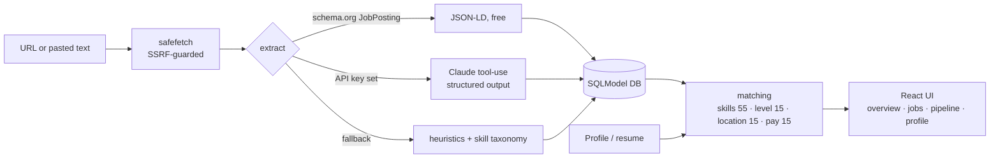
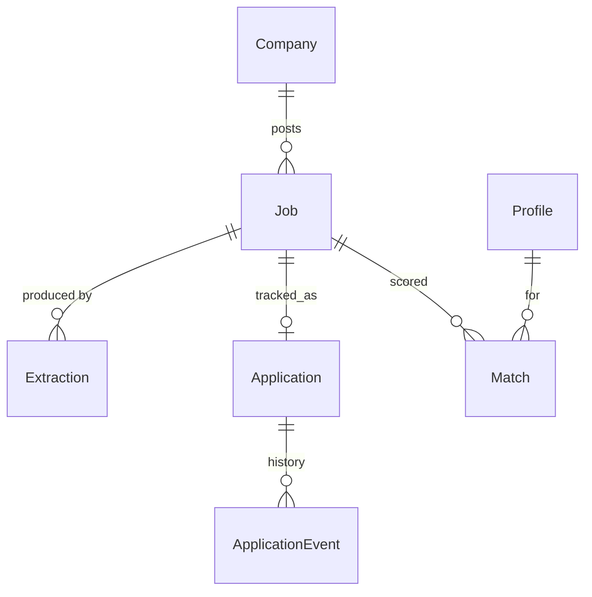

# Jobbr

**Paste a job link. Get structured data, a transparent fit score against your resume, and a pipeline to track it.**

Live at **https://jckail.com/jobbr** · API docs at `/jobbr/api/docs`

> The original prototype (FastAPI + Selenium + LangChain + Supabase experiments) is preserved untouched under the repo root's legacy files and git history; this is the v2 rewrite. See [docs/AUDIT.md](docs/AUDIT.md) for what changed and why.

## How it works



Extraction degrades gracefully, so the app is fully usable with no API key. Every extraction is logged (method, model, tokens, cost, latency). Scores are deterministic and explained, never an opaque LLM number.

## Data model



## Run locally

```bash
# API  (SQLite by default; JOBBR_SEED_DEMO=1 loads demo data)
cd backend && pip install -e ".[dev]" && JOBBR_SEED_DEMO=1 uvicorn jobbr.main:app --reload
# UI   (proxies /jobbr/api to :8000)
cd web && npm install && npm run dev        # http://localhost:5173/jobbr/
pytest backend                               # tests
```

## Deploy (Kubernetes pod at /jobbr)

```bash
docker build -t ghcr.io/jckail/jobbr:latest . && docker push ghcr.io/jckail/jobbr:latest
kubectl apply -f deploy/k8s.yaml            # set JOBBR_API_TOKEN / JOBBR_ANTHROPIC_API_KEY in the Secret first
```

One container serves both API and UI under `/jobbr`, so the Ingress needs no rewrite. CI (`.github/workflows/ci.yml`) lints, tests, builds and pushes the image.

## Configuration (env, prefix `JOBBR_`)

| Var | Default | Purpose |
|---|---|---|
| `DATABASE_URL` | `sqlite:///./jobbr.db` | SQLite or Postgres (`postgresql://…`) |
| `BASE_PATH` | `/jobbr` | Mount path |
| `API_TOKEN` | unset | If set, writes require `X-Jobbr-Token` (public read-only demo) |
| `ANTHROPIC_API_KEY` | unset | Enables Claude extraction |
| `MODEL` | `claude-haiku-4-5-20251001` | Extraction model |
| `SEED_DEMO` | `false` | Load demo data into an empty DB |
