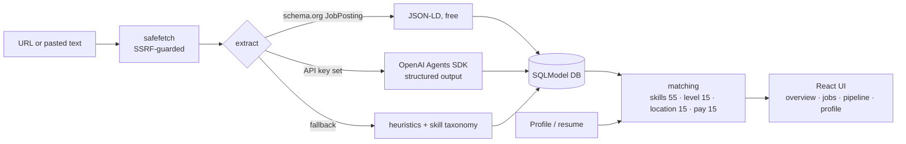
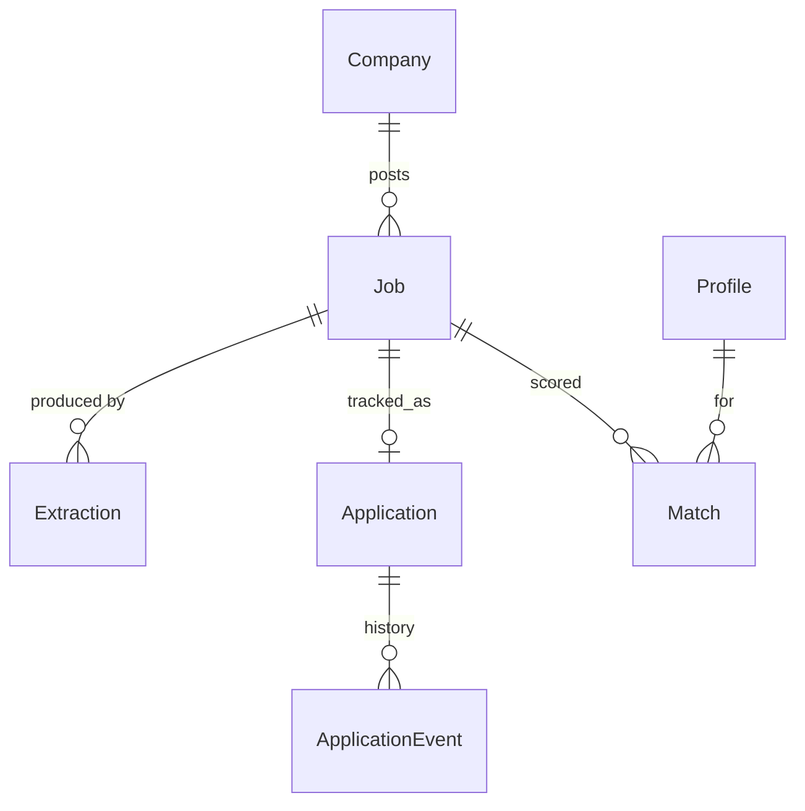

# Jobbr

**Paste a job link. Get structured data, a transparent fit score against your resume, and a pipeline to track it.**

Deployment target: **https://jckail.com/jobbr** (production not yet verified) · API docs at `/jobbr/api/docs`

> The original prototype (FastAPI + Selenium + LangChain + Supabase experiments) is preserved untouched under the repo root's legacy files and git history; this is the v2 rewrite. See [docs/AUDIT.md](docs/AUDIT.md) for what changed and why.

## How it works



Extraction degrades gracefully, so the app is fully usable with no API key. Every extraction is logged (method, model, tokens and latency). OpenAI cost is not yet estimated; the legacy numeric cost field is not evidence of free usage. Scores are deterministic and explained, never an opaque LLM number.

## Data model



## Run locally

```bash
# API  (SQLite by default; JOBBR_SEED_DEMO=1 loads demo data)
cd backend && uv sync --locked --extra dev && JOBBR_SEED_DEMO=1 .venv/bin/uvicorn jobbr.main:app --reload
# UI   (proxies /jobbr/api to :8000)
cd web && npm install && npm run dev        # http://localhost:5173/jobbr/
# checks (same as CI)
(cd backend && .venv/bin/ruff check . && .venv/bin/ruff format --check . && .venv/bin/mypy jobbr && .venv/bin/pytest)
(cd web && npm run check)
```

## Local iteration and deployment

Use [docs/LOCAL.md](docs/LOCAL.md) for the verified development workflow and explicit v2 Compose command. [docs/ROADMAP.md](docs/ROADMAP.md) tracks the full overhaul. [docs/DESIGN.md](docs/DESIGN.md) links the Superdesign prototype awaiting review.

Production at `https://jckail.com/jobbr` remains pending local acceptance, registered OpenAI sign-in configuration and infrastructure verification. `deploy/k8s.yaml` intentionally requires an externally managed Secret and a verified commit image tag. Never apply it with placeholders. The image serves API and UI under `/jobbr` without ingress rewriting. CI checks backend, web and extension and smoke-tests the real image before publishing immutable commit tags on main.

## Configuration (env, prefix `JOBBR_`)

| Var | Default | Purpose |
|---|---|---|
| `DATABASE_URL` | `sqlite:///./jobbr.db` | SQLite or Postgres (`postgresql://…`) |
| `BASE_PATH` | `/jobbr` | Mount path |
| `API_TOKEN` | unset | If set, writes require `X-Jobbr-Token` (public read-only demo) |
| `OPENAI_API_KEY` | unset | Enables OpenAI Agents SDK extraction and drafting |
| `MODEL` | `gpt-4.1-mini` | Extraction model |
| `SEED_DEMO` | `false` | Load demo data into an empty DB |

Private production access uses `JOBBR_PRIVATE_INSTANCE=true` with an API token or configured OpenAI sign-in. See [authentication](docs/AUTH.md), [AI behavior](docs/AI.md), and [database migrations](docs/DATABASE.md). The database is currently single-owner; sign-in does not yet imply multi-user isolation.
